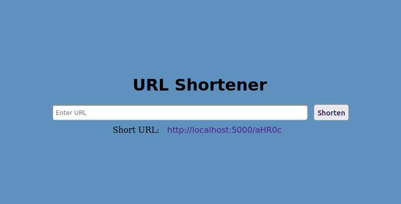

# URL Shortener using Python and Flask

A simple URL shortener web application built using Python and Flask framework, with Redis as the storage database. This application allows users to input a long URL and receive a shortened version that redirects to the original URL.

## Features:

### Shorten long URLs to a more manageable length.
### Redirect users from the shortened URL to the original URL.
### Uses base64 algorithm for encoding URLs.
### Utilizes Redis for efficient storage and retrieval of URLs.

## Prerequisites

### Python 3.x
### Flask
### Redis

## Installation:
### git clone https://github.com/abhishekgunkar1/URL-Shortner.git

## Navigate to the project directory:
### cd URL-Shortner

## Install dependencies using pip:
### pip install -r requirements.txt

## Usage:
### Run the Flask app:
python3 run.py

## Routes
### Home Page: Allows users to input the original URL and receive a shortened URL.
### Redirect: Redirects users to the original URL when they access the shortened URL.

## IMPROVEMENTS:

### 1. The algorithm used to encode the original URL is BASE64 and then extracting the first few chracters of the encoded value. This can lead to collions. To rectify it, some different algorithm can be used which would provide scalability and the Storing and Searching will become efficient.

### 2. This app is prone to online attacks like DOS, DDOS etc. Thus, the rate limiter can be applied to the routes for limiting the number of attempts to hit the api using one IP Address.

### 3. Currently, anyone can create new shortened URL as there is no login feature. So, a login feature can be added for maintaining database consistency and safety.